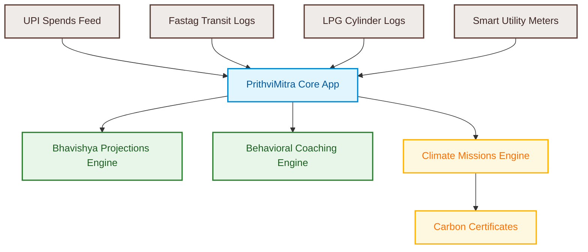
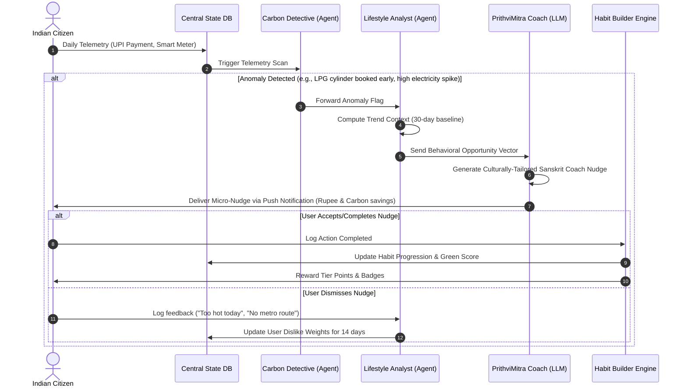
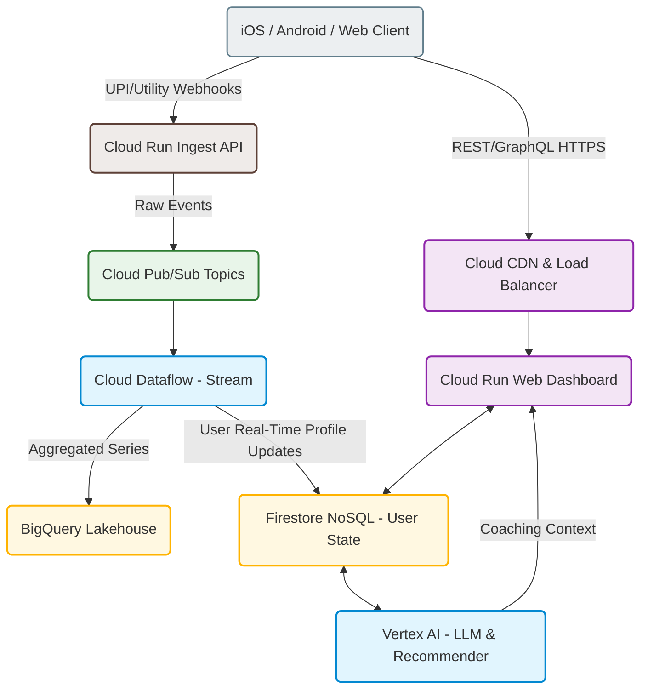
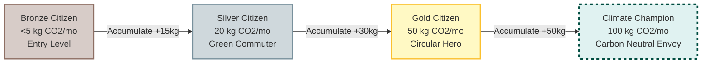

# 🌍 PrithviMitra AI (पृथ्वीमित्र)
### *India's Personal Cognitive-Behavioral Climate Companion*

> [!IMPORTANT]
> **"Small Actions. Lasting Impact. A Greener Bharat, One Citizen at a Time."**  
> PrithviMitra AI (पृथ्वीमित्र) is not just a static carbon calculator. It is a state-of-the-art AI-powered behavioral change ecosystem that models, predicts, and automates personal decarbonization, empowering 1.4 billion Indian citizens to lead sustainable lifestyles (LiFE).

---

## 🗺️ System & Concept Map



---

## 🇮🇳 Core Philosophy & India-First Mathematical Models

PrithviMitra AI translates abstract global climate targets into hyper-localized, culturally resonant household decisions. It runs on carbon and resource mathematics specifically calibrated for the Indian context:

### 1. Coal-Heavy Grid Offset
Unlike Western power grids with low carbon intensity, India's grid is dominated by thermal coal generation.
*   **Indian Grid Emission Factor (\(EF_{grid}\)):** **\(0.780 \text{ kg CO}_2\text{e/kWh}\)** (or \(780\text{ g/kWh}\)).
*   **Impact:** A single unit (kWh) of electricity saved in India prevents more than double the carbon emissions compared to saving a unit in Europe or the US.

### 2. Bureau of Energy Efficiency (BEE) AC Calibration
Air conditioning accounts for a massive chunk of urban Indian electricity consumption. The app implements the BEE directive:
*   **Formula:** For every \(1^\circ\text{C}\) the AC is raised above \(22^\circ\text{C}\), power usage drops by **\(6\%\)**.
*   **Savings Equation:** 
    \[\text{Electricity Saved (kWh)} = \text{AC Hours Run} \times \text{Compressor Rating (kW)} \times (T_{\text{target}} - 22) \times 0.06\]
*   **Carbon Prevented (kg):** \(\text{Electricity Saved} \times 0.780\)

### 3. Sustainable Mobility Swaps
Calculates carbon savings by comparing private internal combustion engine (ICE) transport to public transit options:
*   **Delhi Metro / Mumbai Local:** Emits approximately \(20\text{ g CO}_2\text{e/passenger-km}\).
*   **ICE Petrol Car (Medium):** Emits approximately \(170\text{ g CO}_2\text{e/km}\).
*   **ICE Petrol 2-Wheeler:** Emits approximately \(60\text{ g CO}_2\text{e/km}\).
*   **EV 2-Wheeler (Grid Charged):** Emits approximately \(25\text{ g CO}_2\text{e/km}\).

### 4. Millet & Resource Conservation
Tracks dietary swaps (moving from water-intensive refined white rice to climate-resilient local millets like *Ragi*, *Jowar*, and *Bajra*):
*   **Water Saving Factor:** Millets require **\(70\%\) less water** to cultivate than rice.
*   **Impact Metric:** Saving ~1,200 Liters of water per kg of grain replaced.

---

## 🤖 Dynamic Flowcharts & Orchestration Models

### 1. Multi-Agent Behavioral Feedback Loop
The dynamic orchestration model shows how multiple specialized AI agents continuously analyze data, coordinate context, and deliver highly personalized micro-incentive loops.



### 2. Real-Time GCP Architecture & Data Pipeline
An event-driven serverless system designed to handle ingestion of utility telemetry, credit cards (UPI), and transit taps, feeding into Vertex AI for real-time predictions.



### 3. Gamification Tiers & Progression Path
Users advance through tiers as they accumulate monthly carbon reductions, unlocking real-world benefits.



---

## ✨ Features Highlight

*   **🏆 PrithviMitra AI Coach Banner**: Computes your customized morning **Green Score (0–100)** and translates behavioral metrics into equivalent natural assets (e.g. comparing metro rides to mature banyan trees or hours of energy saved).
*   **✅ Today's Green Actions Checklist**: Log daily climate positive behaviors:
    *   *Set AC to 24°C* (Saves power & cuts coal utility demand).
    *   *Ride Metro/Electric Transit* (Displaces high-carbon private vehicle travel).
    *   *Carry Copper Water Bottles* (Stops Single-Use Plastic imports).
    *   *Cook Millets / Eat Local* (Saves thousands of liters of groundwater).
*   **🔮 Bhavishya Future Impact Engine**: Interactive projection simulator modeling multi-year projections (1-Year, 5-Year, 10-Year cumulative trajectories) for:
    *   Carbon saved in kilograms (\(kg\))
    *   Freshwater saved in Liters (\(L\))
    *   Rupees saved in Indian Rupees (\(₹\))
    *   Banyan Tree equivalents planted
*   **🔗 Telemetry Integrations Sandbox**: Simulated connection status panels mapping feeds to UPI payments, LPG delivery logs, Fastag transit logs, and Smart electricity meters.

---

## 🏗️ Tech Stack

*   **Frontend**: Vanilla HTML5, CSS3 (Glassmorphism layout, HSL responsive palette), and ES6+ JavaScript.
*   **Charting**: Chart.js for smooth animations and micro-interaction rendering.
*   **Containerization**: Nginx Alpine-based web server structure.
*   **Deployment Target**: Google Cloud Run (Containerized Serverless).

---

## 🚀 Production GCP Deployment Guide

Choose your preferred deployment topology to host the PrithviMitra AI app on Google Cloud Platform:

### Option A: Cloud Run (Serverless Web App Container)
*Perfect for dynamic web apps that scale down to zero when idle, saving cloud cost.*

1.  **Login & Set Active Project**
    ```powershell
    gcloud auth login
    gcloud config set project promptwars-virtual-500014
    ```

2.  **Enable Container Registries & Cloud Build APIs**
    ```powershell
    gcloud services enable build.googleapis.com run.googleapis.com containerregistry.googleapis.com
    ```

3.  **Submit Image to Cloud Build**
    ```powershell
    gcloud builds submit --tag gcr.io/promptwars-virtual-500014/prithvi-mitra-app
    ```

4.  **Deploy Container to Cloud Run (Targeting Nginx Port 80)**
    Ensure the ingress is configured for public access and target port matches the Nginx port:
    ```powershell
    gcloud run deploy prithvi-mitra-app `
      --image gcr.io/promptwars-virtual-500014/prithvi-mitra-app `
      --port 80 `
      --platform managed `
      --allow-unauthenticated `
      --region us-central1
    ```

---

### Option B: Cloud Storage Static Website Hosting
*The cheapest static site option. High performance CDN caching with near-zero costs.*

1.  **Create a New GCS Bucket**
    ```powershell
    gcloud storage buckets create gs://prithvi-mitra-bucket --location=asia-south1 --uniform-bucket-level-access
    ```

2.  **Upload Static Assets**
    ```powershell
    gcloud storage cp index.html style.css app.js gs://prithvi-mitra-bucket/
    ```

3.  **Configure Bucket as Website Directory**
    ```powershell
    gcloud storage buckets update gs://prithvi-mitra-bucket --web-main-page-suffix=index.html
    ```

4.  **Expose Objects to Public Access**
    ```powershell
    gcloud storage buckets add-iam-policy-binding gs://prithvi-mitra-bucket --member=allUsers --role=roles/storage.objectViewer
    ```

---

### Option C: Firebase Hosting (Recommended for Global CDNs)
*Provides free SSL certificates, custom domains, and edge-side static optimization.*

1.  **Install Firebase CLI globally**
    ```bash
    npm install -g firebase-tools
    ```
2.  **Login and Initialize**
    ```bash
    firebase login
    firebase init hosting
    ```
    *Select project `promptwars-virtual-500014`, choose your current folder as the public directory, and configure as a single-page app.*
3.  **Deploy Website**
    ```bash
    firebase deploy
    ```

---

## 💻 Local Setup & Development

To modify the app locally:

1.  **Clone & Open Workspace**
    ```bash
    git clone https://github.com/SwetaPilla/promptwars.git
    cd "Promptwars 3"
    ```

2.  **Install HTTP Server**
    ```bash
    npm install
    ```

3.  **Run Server**
    ```bash
    npm start
    ```
    *This runs `npx http-server -p 8080` in the workspace root.*

4.  **Open URL**
    Navigate to [http://localhost:8080](http://localhost:8080) to test updates instantly.

---

## 📄 License
This project is licensed under the Apache 2.0 License - see the [LICENSE](LICENSE) file for details.
